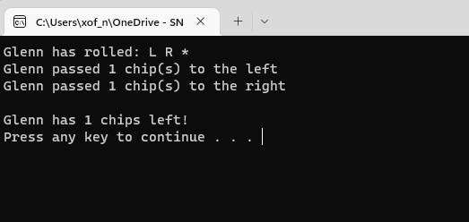

## 1. Professional Self-Assesment

I started my degree in Computer Science in may 2018 at SNHU. Since starting I have learned many things. I learned how to effectively communicate my thoughts through writing, how to research topics, and most importantly I learned about many aspects of Computer Science. I learned about collaborating in a team environment in a class I took called “Collaboration and Team Project”. In that class I learned about GIT and how it can be used to collaborate with other team members on the same project. In the class “Software Development Life-cycle” I learned about the the agile methodology and the duties the different roles perform. I demonstrated my ability to communicate to stakeholders during the class when we had to draft emails to various other members of the team. I also took other classes to learn about data structures and algorithms, software engineering, databases, and security. I will show how I demonstrated learning those topics later in the portfolio with my chosen artifacts.
  
The artifacts I choose demonstrate my abilities in Software Design and Engineering, Algorithms and Data Structures, and Databases. These artifacts demonstrate how I met the program’s outcomes. I chose artifacts written in different languages to show how I am able to apply my skills in different languages. These artifacts also show how I met the program’s outcome by making enhancements to code I had written during my time at SNHU.

* * *

## 2. Code Review

[Code review video](https://www.youtube.com/watch?v=_50OmyEW5Zs)

* * *

## 3. Software Design and Engineering

[Link to project Github](https://github.com/glenn-fox/LCR)

My first artifact is a dice game called LCR. It was created in IT-312 class and is written in C++. This artifact was chosen for my ePortfolio as it shows my ability to use C++ to implement design solutions and accomplish goals. This artifact shows my attention to detail, by validating input to make sure that the user inputs what is expected by the program and handles invalid input properly to avoid the program crashing. The course outcome that I met by making the enhancements were “the student demonstrates the ability to use innovative skills and techniques for implementing design solutions and accomplishing goals” and “the student demonstrates the ability to address potential design flaws related to security”.

I enhanced the artifact by adding more to the player class. I added a variable to store whether the player is a computer or not. This way different aspects of the program can be altered for human and computer players. I also modified the getInt function to take in a minimum and maximum value. This increased the usefulness of the function. Now the function will not accept anything that is not an integer, and not within the range specified. Now the input validation is in one function and can be used in various ways. A challenge I faced was moving the functions to a separate file so they can be accessed by other file, like the main function, as well as in other class files. 

#### This is the main menu of the LCR game


#### Here is a sample of the result of a roll



* * *

## 4. Algorithm and Data Structures

[Link to project Github](https://github.com/glenn-fox/Sudoku)

My second artifact for the algorithms and data structure category is a Sudoku solver. It was created as a personal project and submitted as part of the final project for CS-260. It is written in Python. I selected this artifact to show my ability in creating and implementing algorithms for solving problems. This program uses recursion to try possible numbers in each cell. The original solving function started with the first empty cell it found and continued on to the next until the board was solved. I created a new function that goes through the empty cells and finds the numbers that can go into the cell. It then goes through the cells in order of the least number of valid moves to the most number of valid moves. This enhancement makes the algorithm faster for solving boards. 

Making this enhancement satisfies the course outcome: “The student demonstrates the ability to program solutions to solve logic problems involving algorithms or data structures” and “The student demonstrates the ability to use innovative skills and techniques for implementing design solutions and accomplishing goals”. The enhancement shows how I used the skills learned in this program to improve the logic in exciting programs and my ability to implement those solutions. I ran into an issue when making the enhancements. I learned that when making copy of lists you cannot just simply “new_list = old_list” as any modifications to any of the lists will also be made in the other list. List must be explicitly copied to avoid having this happen.

#### This is the output after running the tests


* * *

## 5. Database

[Link to project Github](https://github.com/glenn-fox/RegisterStudent)

My third artifact is a program to register students for courses. It was created in IT-230 and written in C#. This artifact was included in my portfolio as it showcases the skills, I learned with creating databases. I created a MongoDB database with collections for the students and the courses. I implemented CRUD functionality by allowing the user to create new students, read from both the students and the courses collection, update exciting students, and delete students. Before the enhancement students were not stored, and the courses were hard coded into the program. Now, students can be added and removed, and courses can also be added to the database.

Making these changes show that I achieved the course outcomes: “the student demonstrates the ability to use innovative skills and techniques for implementing database solutions and accomplishing project goals”, and “the student demonstrates the ability to program solutions to solve problems involving storing, manipulating, or accessing data”. The challenges I faced while making the enhancements were designing the database and learning how to connect to and access MongoDB in C#. Designing the database was a challenge as I wanted to make sure enough information was stored but not too much that it is overwhelming with the information it requests from the user. The second challenge was solved by watching a tutorial to lean the functions needed to implement the CRUD function, then customizing them into my program.

#### This the main menu and a search of the database for a student Id


#### Here is a listing of the courses in the database


* * *

Text can be **bold**, _italic_, or ~~strikethrough~~.

[Link to another page](./another-page.html).

There should be whitespace between paragraphs.

There should be whitespace between paragraphs. We recommend including a README, or a file with information about your project.

# Header 1

This is a normal paragraph following a header. GitHub is a code hosting platform for version control and collaboration. It lets you and others work together on projects from anywhere.

## Header 2

> This is a blockquote following a header.
>
> When something is important enough, you do it even if the odds are not in your favor.

### Header 3

```js
// Javascript code with syntax highlighting.
var fun = function lang(l) {
  dateformat.i18n = require('./lang/' + l)
  return true;
}
```

```ruby
# Ruby code with syntax highlighting
GitHubPages::Dependencies.gems.each do |gem, version|
  s.add_dependency(gem, "= #{version}")
end
```

#### Header 4

*   This is an unordered list following a header.
*   This is an unordered list following a header.
*   This is an unordered list following a header.

##### Header 5

1.  This is an ordered list following a header.
2.  This is an ordered list following a header.
3.  This is an ordered list following a header.

###### Header 6

| head1        | head two          | three |
|:-------------|:------------------|:------|
| ok           | good swedish fish | nice  |
| out of stock | good and plenty   | nice  |
| ok           | good `oreos`      | hmm   |
| ok           | good `zoute` drop | yumm  |

### There's a horizontal rule below this.

* * *

### Here is an unordered list:

*   Item foo
*   Item bar
*   Item baz
*   Item zip

### And an ordered list:

1.  Item one
1.  Item two
1.  Item three
1.  Item four

### And a nested list:

- level 1 item
  - level 2 item
  - level 2 item
    - level 3 item
    - level 3 item
- level 1 item
  - level 2 item
  - level 2 item
  - level 2 item
- level 1 item
  - level 2 item
  - level 2 item
- level 1 item

### Small image


### Large image


### Definition lists can be used with HTML syntax.

<dl>
<dt>Name</dt>
<dd>Godzilla</dd>
<dt>Born</dt>
<dd>1952</dd>
<dt>Birthplace</dt>
<dd>Japan</dd>
<dt>Color</dt>
<dd>Green</dd>
</dl>

```
Long, single-line code blocks should not wrap. They should horizontally scroll if they are too long. This line should be long enough to demonstrate this.
```

```
The final element.
```
